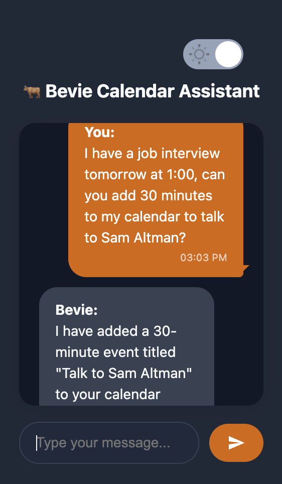
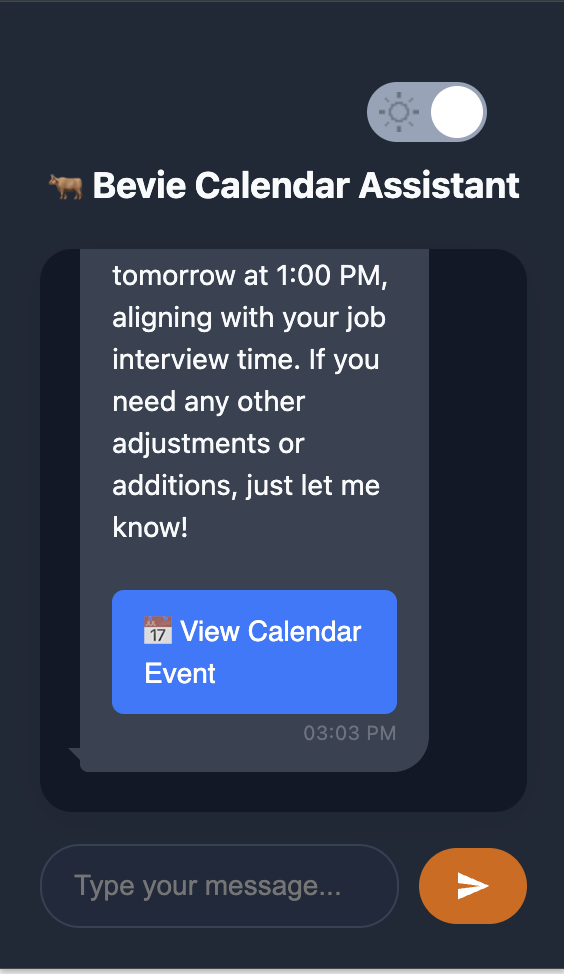
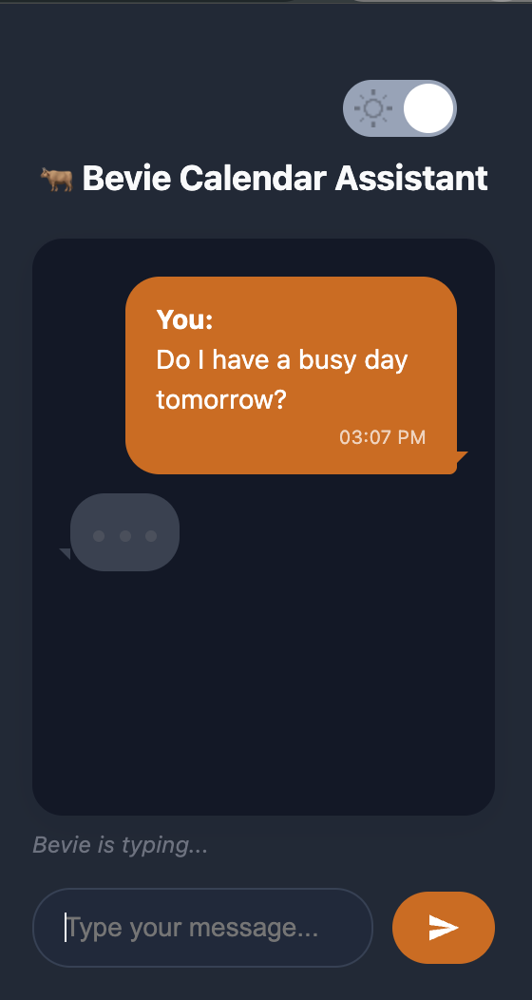
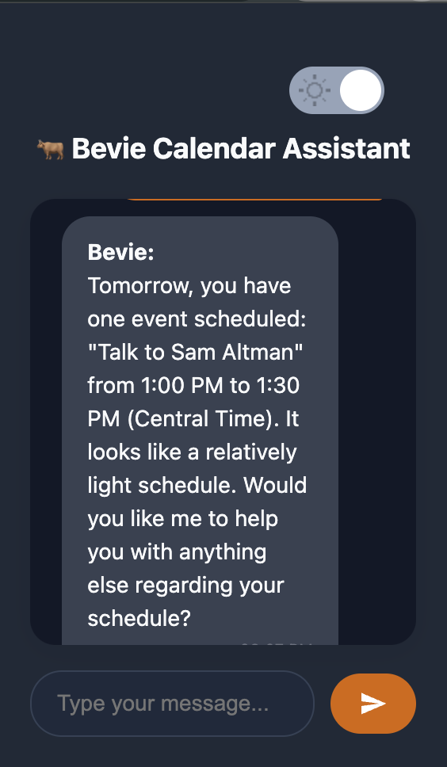

# AI Calendar Assistant with Autogen

A console-based AI calendar assistant built with Autogen that helps manage your schedule through natural language interactions.

## Features
- Natural language processing for CRUD calendar operations
- Chrome Extension UI

### Example - Create An Event




### Example - Check Schedule




## Installation

### Prerequisites
- Python 3.8+
- Access to an MCP server
- [uv](https://github.com/astral-sh/uv) (recommended) or pip

### Using uv (Recommended)
1. Clone the repository
2. Install dependencies and create a virtual environment:
   ```bash
   uv venv  # Create a new virtual environment
   source .venv/bin/activate  # Activate the virtual environment
   uv pip install -r requirements.txt  # Install dependencies
   ```
3. Create a `.env` file with your MCP server details (See: Configuration)

### Using pip (Alternative)
1. Clone the repository
2. Create and activate a virtual environment
3. Install dependencies:
   ```bash
   python -m pip install -r requirements.txt
   ```
4. Create a `.env` file with your MCP server details

## Usage
Run the assistant with:
```
uvicorn server:app --reload --host 0.0.0.0 --port 8000
```

Or, if you have `task` installed:
```
task run
```

## Configuration
Create a `.env` file in the project root with the following variables:
```
# OpenAI API Key (required for Autogen)
OPENAI_API_KEY=your_openai_api_key_here

# MCP Server Configuration (required)
MCP_SERVER_URL=your_mcp_server_url_here
MCP_API_KEY=your_mcp_api_key_here
```
